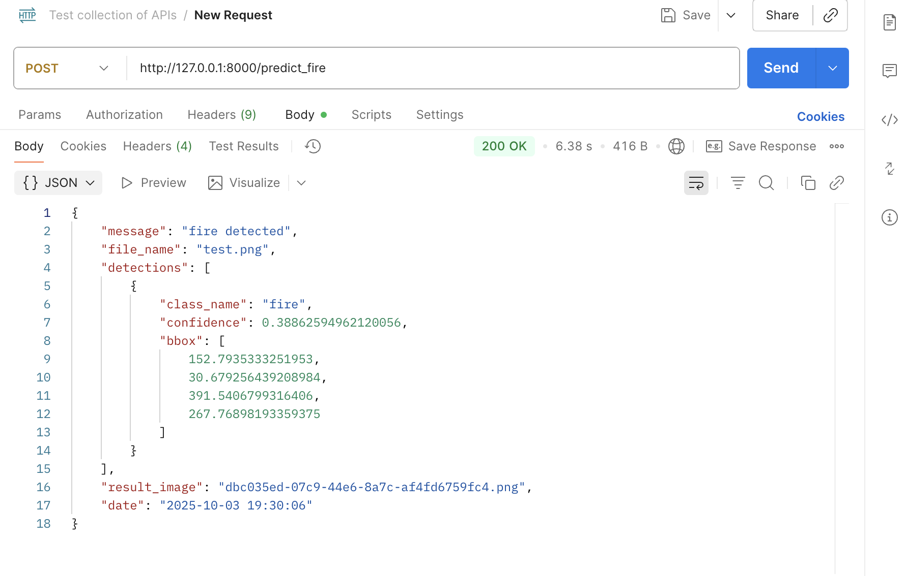

# FlameGuard_2

### backend
```
cd backend/
fastapi dev app/main.py

```


## backend

* yolov11
* ultralytics: httpsL//docs.ultralytics/com/usage/python
* roboflow
* conda
* fastapi
* sqlite https://www.sqlalchemy.org/
* argon2: https://pypi.org/project/argon2-cffi/
    - feature-based-modularization 
    - 기존 MVC랑 다르게 API 엔드포인트 중심 


- router: endpoint 처리
- scheme: 데이터 유효성 검사, API 입출력 모델 정의 관리
- CRUD: 데이터베이스 작업 처리
```
# conda

conda env list
conda info —envs
conda remove —name myenv —all

# yolo
conda activate flameguard
conda deactivate

# fastapi
fastapi dev app/main.py
```

postman



## frontend


- nextjs: https://nextjs.org/
- https://pnpm.io/ko/installation

- TanStack Query: 
```
# next.js
npx create-next-app@latest
pnpm run dev

npm install 0g pnpm@latest-10
pnpm run dev


```


### 추가과제
1. 화재 감지 로그 페이지에서 Home으로 이동하는 버튼 추가
2. 감지 민감도 설정을 개선하여 0.7이하의 감지는 무시하도록 필터링
3. CSS 스타일을 보기좋게 개선 